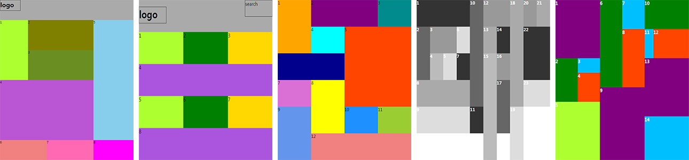

# Tutorial

## 개념

1. HTML(Hyper Text Markup Language)
    - 웹 페이지의 논리 구조를 통해 콘텐츠를 표시하는 언어
    - HTML5 추가된 요소 : header, footer, section, nav, article, aside

2. CSS
    2-1. CSS2
        - 개체( 대상 ) 스타일 관련 CSS
        - 레이아웃( 박스모델 ) 관련 CSS

    2-2. CSS3
        - 개체( 대상 ) 스타일 관련 CSS
        - 변환, 애니메이션 관련 CSS
        - flex : 레이아웃 CSS

3. Selector( id, class )

id attribute 는 서버개발(백엔드개발)과 연관되기 때문에
가급적 사용하지 않는것이 좋음.

id는 유일해야 함

Ex)

 => 오류

class 이름은 하나의 태그에 여러개 사용할 수 있고, 같은 웹페이지에
똑같은 이름을 여러번 사용할 수 있음

Ex)

 => text 이름 한개

 => text, description, guide 이름 세개

## 웹폰트

1. 온라인 서비스
    - 구글 폰트
    - 유료 웹폰트 서비스( 타이포링크 )

2. 로컬 파일
    - eot, woff 파일 변환
    - @font-face 직접 정의한 후에 사용

## Tutorial 연습 소스

1. HTML

- [01_html_ex_01.html](https://github.com/ministori/tutorial/blob/master/01_html_ex_01.html) : 기초 구조 예제
- [01_html_ex_02.html](https://github.com/ministori/tutorial/blob/master/01_html_ex_02.html) : 종합 연습(제목태그, 단락태그)
- [01_html_ex_03.html](https://github.com/ministori/tutorial/blob/master/01_html_ex_03.html) : 종합 연습(address 태그)
- [01_html_ex_04.html](https://github.com/ministori/tutorial/blob/master/01_html_ex_04.html) : 블럭/인라인 요소 정리
- [01_html_ex_05.html](https://github.com/ministori/tutorial/blob/master/01_html_ex_05.html) : 인용문 태그 연습
- [01_html_ex_06.html](https://github.com/ministori/tutorial/blob/master/01_html_ex_06.html) : img 태그 연습
- [01_html_ex_07.html](https://github.com/ministori/tutorial/blob/master/01_html_ex_07.html) : Anchor 태그 연습 / 이미지 맵( 하나의 이미지에 여러 개의 링크 연결 )
- [01_html_ex_08.html](https://github.com/ministori/tutorial/blob/master/01_html_ex_08.html) : 리스트 태그 연습 ( 정의, 비순차 )
- [01_html_ex_09.html](https://github.com/ministori/tutorial/blob/master/01_html_ex_09.html) : 리스트 태그 연습 ( 순차 )
- [01_html_ex_10.html](https://github.com/ministori/tutorial/blob/master/01_html_ex_10.html) : 테이블 태그 연습
- [01_html_ex_11.html](https://github.com/ministori/tutorial/blob/master/01_html_ex_11.html) : 폼 태그 연습
- [01_html_ex_12.html](https://github.com/ministori/tutorial/blob/master/01_html_ex_12.html) : xmp 태그
- [01_html_practice_01.html](https://github.com/ministori/tutorial/blob/master/01_html_practice_01.html) : HTML 종합 연습 - 위키백과 HTML
- [01_html_practice_02.html](https://github.com/ministori/tutorial/blob/master/01_html_practice_02.html) : HTML 종합 연습 - 위키백과 CSS
- [01_html_practice_03.html](https://github.com/ministori/tutorial/blob/master/01_html_practice_03.html) : HTML 종합 연습 - 위키백과 Javascript
- [01_html_structure_01.html](https://github.com/ministori/tutorial/blob/master/01_html_structure_01.html) : 사이트 제작 연습(ARTICA 웹사이트 목업) - HTML 초안

2. CSS

- [02_css_ex_01.html](https://github.com/ministori/tutorial/blob/master/02_css_ex_01.html) : 작성 방법 3가지 정리
- [02_css_ex_02.html](https://github.com/ministori/tutorial/blob/master/02_css_ex_02.html) : 선택자 정리
- [02_css_ex_03.html](https://github.com/ministori/tutorial/blob/master/02_css_ex_03.html) : 가상 클래스 정리
- [02_css_ex_04.html](https://github.com/ministori/tutorial/blob/master/02_css_ex_04.html) : 가상 요소 정리
- [02_css_ex_05.html](https://github.com/ministori/tutorial/blob/master/02_css_ex_05.html) : 리스트 스타일
- [02_css_ex_06.html](https://github.com/ministori/tutorial/blob/master/02_css_ex_06.html) : 폰트 스타일
- [02_css_ex_07.html](https://github.com/ministori/tutorial/blob/master/02_css_ex_07.html) : 단락 스타일
- [02_css_ex_08.html](https://github.com/ministori/tutorial/blob/master/02_css_ex_08.html) : 배경 스타일
- [02_css_ex_09.html](https://github.com/ministori/tutorial/blob/master/02_css_ex_09.html) : 박스 모델
- [02_css_ex_10.html](https://github.com/ministori/tutorial/blob/master/02_css_ex_10.html) : 레이아웃 - float
- [02_css_ex_11.html](https://github.com/ministori/tutorial/blob/master/02_css_ex_11.html) : 블럭요소 / 인라인 요소의 박스모델 CSS 적용 차이점
- [02_css_ex_12.html](https://github.com/ministori/tutorial/blob/master/02_css_ex_12.html) : position
- [02_css_ex_13.html](https://github.com/ministori/tutorial/blob/master/02_css_ex_13.html) : 웹사이트 기초 레이아웃 구성
- [02_css_ex_14.html](https://github.com/ministori/tutorial/blob/master/02_css_ex_14.html) : 웹사이트 3단 레이아웃 구성

- [02_css_ex_15.html](https://github.com/ministori/tutorial/blob/master/02_css_ex_15.html) : 복잡한 레이아웃 연습 1
- [02_css_ex_16.html](https://github.com/ministori/tutorial/blob/master/02_css_ex_16.html) : 복잡한 레이아웃 연습 2
- [02_css_ex_17.html](https://github.com/ministori/tutorial/blob/master/02_css_ex_17.html) : 복잡한 레이아웃 연습 3-1
- [02_css_ex_18.html](https://github.com/ministori/tutorial/blob/master/02_css_ex_18.html) : 복잡한 레이아웃 연습 3-2
- [02_css_ex_19.html](https://github.com/ministori/tutorial/blob/master/02_css_ex_19.html) : 복잡한 레이아웃 연습 4
- [02_css_ex_20.html](https://github.com/ministori/tutorial/blob/master/02_css_ex_20.html) : 복잡한 레이아웃 연습 5

3. 구현 기법 정리

- [03_center_align.html](https://github.com/ministori/tutorial/blob/master/03_center_align.html) : 가로/세로 방향 가운데 정렬
- [03_css_triangle.html](https://github.com/ministori/tutorial/blob/master/03_css_triangle.html) : border를 이용해서 삼각형 만들기
- [03_image_technic.html](https://github.com/ministori/tutorial/blob/master/03_image_technic.html) :이미지 표현 기법

4. GNB 제작 및 네이밍 연습

- [naming_exercise_01.html](https://github.com/ministori/tutorial/tree/master/naming_exercise) : 네이밍 연습, 복잡한 구조의 GNB 연습

5. Javascript

